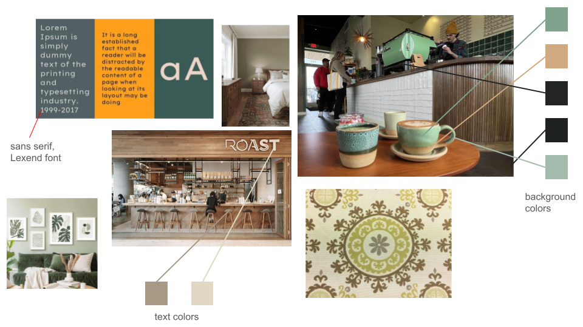
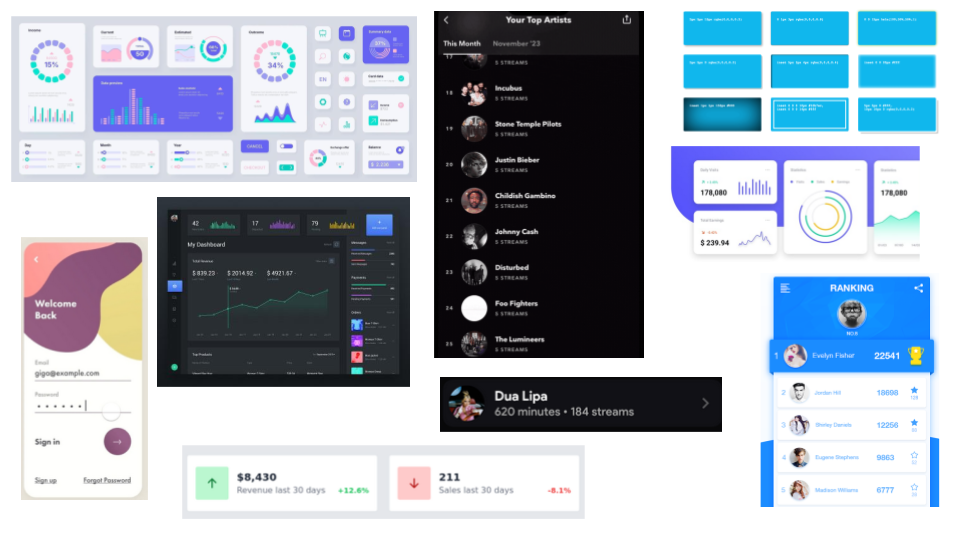

# Visual Design Study

---

# Development Design Notes

Many of the concepts underwent heavy changes or were reimagined, taking into account the feedback from Assignment 2. On a high level, all interactions with the ListenBrainz and MusicBrainz APIs were put in their own wrapper concepts. Recommendations were also changed to work off of MusicBrainz queries, and do the LLM refinement later with just natural language, basically. I copied the geminiLLM service from the LLM prep assignment to be able to make the Recommendation more modular.

## Assignment 4a Development Insights/Moments
  * I decided to include a [@backend-concept-development](design/background/backend-concept-development.md) as extra context included in the prompts, a document which gives a rundown on all the concepts so that the AI has some kind of idea of how these are gonna interact together (still recognizing the fact these are independent, just for ease of implementation). I also included information about the APIs we'd be using (ListenBrainzAPI and MusicBrainzAPI). I'm not sure if the relatively positive result I got out of its implementations for these were due to this, but I think it may have helped to provide some overarching information to educate the implementations, like rate limiting for the external APIs.
  * I was generally impressed with gemini's ability to nail most endpoints to the APIs, but starting from its implementation of the ListenBrainzAPI I quickly noticed it had formulated some requests and gotten some endpoints wrong. I refactored [@20251018_110233.f7d5bfd3](context/design/concepts/ListenBrainzAPI/implementation.md/20251018_110233.f7d5bfd3.md) to [@20251018_132449.066623c6](context/src/concepts/ListenBrainzAPI/ListenBrainzAPI.ts/20251018_132449.066623c6.md) after the AI implementation to fix these. I also fixed the handling for the response payloads, since the AI was expecting responses nested one layer too deep (or one too few).
  * As part of the many changes I made to the concepts during implementation, I adjusted the ListenBrainzAPI concept at [@20251018_155304.65018526](context/src/concepts/ListenBrainzAPI/ListenBrainzAPI.ts/20251018_155304.65018526.md) to remove the submitListens action previously included (since we're not working with scrobbling directly in this web app).
  * During testing I was also able to positively iterate on my concepts. Particularly in the change at [@20251018_203712.6228fa92](context/src/concepts/ListenBrainzAPI/ListenBrainzAPI.ts/20251018_203712.6228fa92.md), I was able to run each of these requests and strengthened the spec and interfaces to better reflect the payload received from the actual API. At this point, I wasn't using the context tool to develop these changes but rather refactoring them myself and doing context saves frequently.
  * During the implementation of MusicBrainzAPI's tests and getting to look at the API responses for the entity relationships, I noticed these were just metadata related and weren't at all indicative of something we could pull suggestions from, so I had to rework the way suggestions would be handled. I had to think hard about this as this would undoubtedly involve MusicBrainz fetches so it should probably be in the MusicBrainzAPI concept, although the methods for similarities would include some extra logic outside of just calling MusicBrainz API endpoints. Still, I decided on including it in the MusicBrainzAPI concept as I think it was most appropriate. As a result MusicBrainzAPI also went from [@20251018_132438.f4743ed2](context/src/concepts/MusicBrainzAPI/MusicBrainzAPI.ts/20251018_132438.f4743ed2.md) to [@20251018_214842.e5dcce49](context/src/concepts/MusicBrainzAPI/MusicBrainzAPI.ts/20251018_214842.e5dcce49.md). The refactoring for this concept also included fixing endpoints and API request functionality (including rate limiting), similarly to ListenBrainzAPI. 
  
A lot of the refactoring and "interesting moments" for this were more so confirming the external api payloads with Postman or fixing incorrect integrations, but overall most of the context integrations were pretty good and (mostly) worked out of the box, definitely warranting some correction but not too much.

## Assignment 4b Changes

One of the major changes during the frontend development was to the Recommendation concept's function signatures and structure. I initially wanted to keep all the recommendations 'native' to MusicBrainz primarily in order to be able to load cover images for recommendations and also guided by the expectation that the relationships for entities and the tagging would be a bit more elaborate. Unfortunately this was not the case (possibly due to the obscurity of the music I was testing for from my library) and I've decided to still pass MusicBrainzAPI info to Recommendation but just have this be extra context for the LLM to give recommendations, which were easily better than anything I could derive just from the MusicBrainz tags and limited querying features.

I modified the MusicBrainzAPI to fall back to retrieving tags from albums and then fall back to artists in the case that it didn't find tags, which was fairly frequent during testing with my own data. I also strengthened the rate limiting implementation according to the API documentation for the MusicBrainz API and the ListenBrainz API.

I also modified the UserConcept to store the ListenBrainz name of the user in the database as we use it in the UI.

## Assignment 4c Changes

Following 4b, ListenBuddy was running perfectly end-to-end locally and all tests were passing, so concepts were not modified at all ahead of the final deadline apart from refactoring to work off the new Requesting concept.

The visual design hasn't really evolved since the first implementation either, largely because I made an effort on the stylings from the first iteration. I started developing with a clear idea of the greater throughlines for my design, primarily a beige + sage color palette, the font (Lexend), the .card style that most components used, and the general layout and look/feel of the web app. The largest change came in the recommendation screen, which I decided to make a modal and reworked the way the percentages were shown. 

The largest changes I made in following deliverables came in the card and item stylings. Specifically, I worked on the box shadow to get the intended glow effect in colors that worked for the color palette, and I modified the hover style to apply some offset to the position and change the box shadow color, which I feel is one of the more intentional design decisions that unify the color design. The other design change I made was to the header, which I've made sticky and have lower opacity so that it stays on top without obstructing visually.